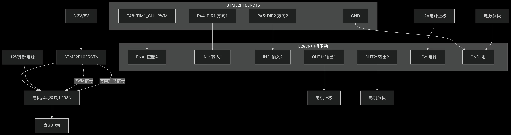
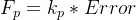
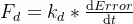
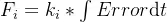
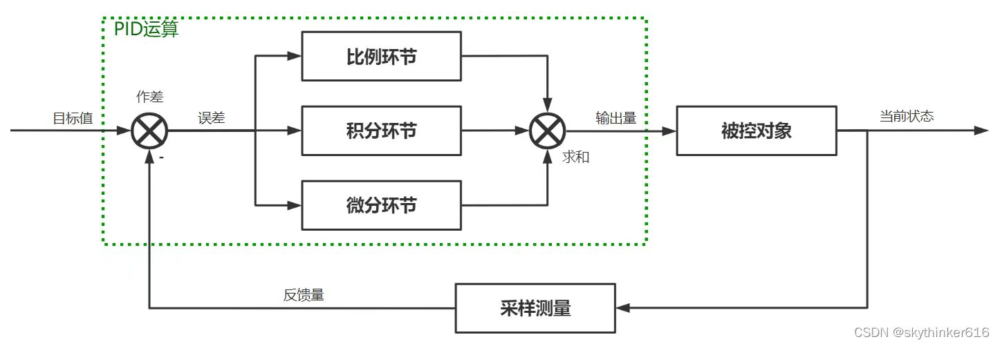

# 驱动电机
## TASK1
这个任务主要程序与呼吸灯类似，通过对pwmccr的递增来调控电机转速，我定义了arr=500，写了一个motor驱动，设置了高低电平引脚，难点主要在于硬件连接，主要的连接图像如下


## TASK2
主要是通过读取tim（完成了combined）中的数据来读取encoder的参数，在task3中也是，但是task3还把参数通过uart传递给了下位机，还需要一个vofa_senddata来打印曲线，主要代码如下
```c
void VOFA_SendAngleData(float angle,float revolutions,float speed,float time)
{
  vofa_data[0]=angle;
  vofa_data[1]=revolutions;
  vofa_data[2]=speed;
  vofa_data[3]=time;
  int len=sprintf((char *)vofa_buffer,"Angle:%.2f,Revolutions:%.2f,Speed:%.2f,Time:%.2f\r\n",
                  vofa_data[0],vofa_data[1],vofa_data[2],vofa_data[3]);
  HAL_UART_Transmit_DMA(&huart1,vofa_buffer,len);
}//发送数据函数
```
同时要注意处理数据的溢出，溢出中断处理函数：
```c
void HAL_TIM_PeriodElapsedCallback(TIM_HandleTypeDef *htim)
{
  if(htim->Instance == TIM3)//编码器计数器溢出中断
  {
    if(__HAL_TIM_IS_TIM_COUNTING_DOWN(&htim3))
    {
      Encoder_Overflow_Count--;
    }
    else
    {
      Encoder_Overflow_Count++;
    }
  }
}
```
还有角度计算和速度计算，一般是  
>角度=（计数器的值/(编码器线数*4)）*360
>M法：固定时间间隔T，读取编码器的脉冲数△N，转速=（△N/（线数*4））/T*60（RPM）
>T法：测量两个相邻脉冲之间的时间跨度
M法在高速时精度高，T法则是低速时转速高

## Task3
实现pid的控制，上述的手段可以：1.读取编码器的值，从而判断现在的位置；2.利用pwm来使得电机转到相应的角度。此时需要一个算法来控制电机的位置，以及怎么样让电机转回相对应的位置。  
>由于电机转到相应的位置时有惯性，不可能完全停下来，所以我们需要通过一个反馈来让电机停下
当电机在30°下，施加一个往30°的力，反之亦然
>但是还是会因为惯性导致出现误差
### PID
1.计算误差error = target - current  
2.比例环节：  
这个环节用来计算误差和对应的力大小，可以让电机在30°附近做简谐运动
3.微分环节：  
这个环节用来产生一个力来始终阻碍电机在30°附近运动，从而产生阻尼运动的效果，让电机做一个带阻尼的简谐运动  
4.积分环节：由于error越小的时候，前两个环节的F也会越小，所以小球永远没法在目标点准确停下，所以需要积分环节来使得误差持续存在时，增大积分的F大小来试图消除误差  

### PID术语和信号图
被控对象：需要控制的对象，案例中指小球  
目标值：期望被控对象达到的状态量，案例中指目标位置的坐标  
反馈值：被控对象当前时刻的状态量，案例中指小球的实时位置坐标\n输出量：PID的计算结果，案例中指控制力\n误差：目标值-反馈值\n稳态  误差：系统稳定状态下仍存在的误差，如案例中加入干扰恒力后小球静止时仍存在的误差  阶跃输入：在稳定状态下目标值发生突然变化（上图目标值在0时刻由0跃升到虚线位置）  阶跃响应：阶跃输入后被控对象的跟随状态，能够代表系统的控制性能（上图彩色线条）  响应速度：阶跃输入后被控对象再次到达目标值的速度  超调量：阶跃输入后，被控对象到达目标值后超出目标值的距离（上图各彩色线条第一个峰值与目标值的距离）

### 本人的完整代码实现
```c
float PID_Calculate(float setpoint,float feedback)
{
    extern uint32_t system_time;
    static uint32_t last_calc_time = 0;
    float dt,error,derivative,output;
    if(last_calc_time ==0)
    {
        dt = 0.01f;
    }
    else{
        dt = (float)(system_time - last_calc_time) / 1000.0f;
        if(dt <= 0)
        dt = 0.01f;
    }
    last_calc_time = system_time; //计算时间间隔（s）
    error = setpoint - feedback; //计算误差
    output = angle_pid.Kp*error; //比例
    angle_pid.integral += error*dt;
    if(angle_pid.integral > angle_pid.integral_max)
      angle_pid.integral = angle_pid.integral_max;
    if(angle_pid.integral < -angle_pid.integral_max)
      angle_pid.integral = -angle_pid.integral_max;
    output += angle_pid.Kd*angle_pid.integral; //积分项（带限幅）
    derivative = (error - angle_pid.prev_error)/dt;
    output += angle_pid.Kd*derivative;
    angle_pid.prev_error = error; //微分项

    if(output > angle_pid.output_max)
     output = angle_pid.output_max;
    if(output < angle_pid.output_min)
     output = angle_pid.output_min; //输出限幅

    return output;

}
```
## 主要参数与串口配置
GPIO_PIN_A_1和GPIO_PIN_A_2实现方向控制（一高一低）  GPIO_PIN_A_0对应TIM2的PWM输出，用来控制电机转动  GPIO_PIN_A_9对应USART_RX，GPIO_PIN_A_10对应USART_TX，启动了USART1来进行串口调试（我懒得再去每次调试还要重新烧录程序了）  GPIO_PIN_B_4和GPIO_PIN_B_5用来读取encoder的值，使用了tim3来combine
>注意：连接电机的TB6612通电前一定要检查和12v电压是否正确连接，方向没有反，否则可能有火灾风险 
参考资料来源：[CSDN的PID控制原理](https://blog.csdn.net/skythinker616/article/details/123019829)  
[读取电机编码值](https://blog.csdn.net/da_xian_yu/article/details/119984955?sharetype=blog&shareId=119984955&sharerefer=APP&sharesource=2502_94084155&sharefrom=link)

